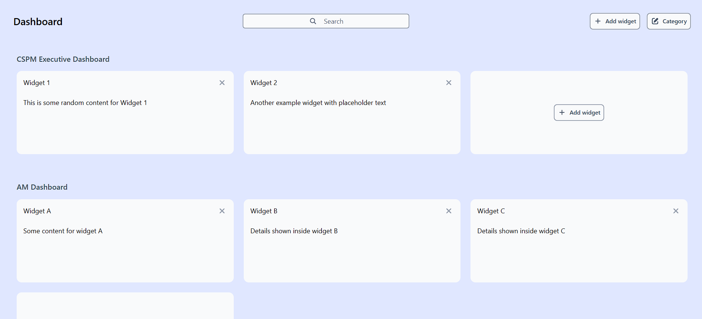
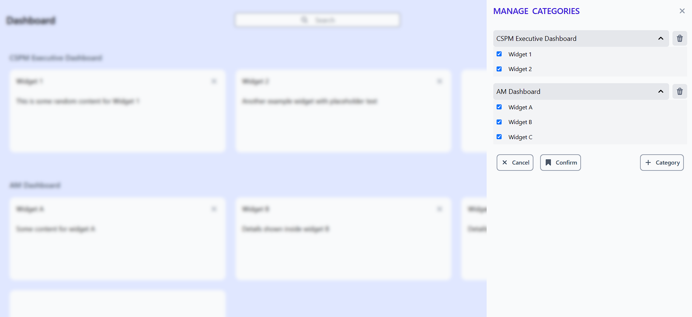
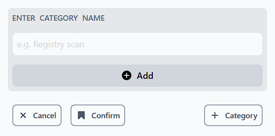
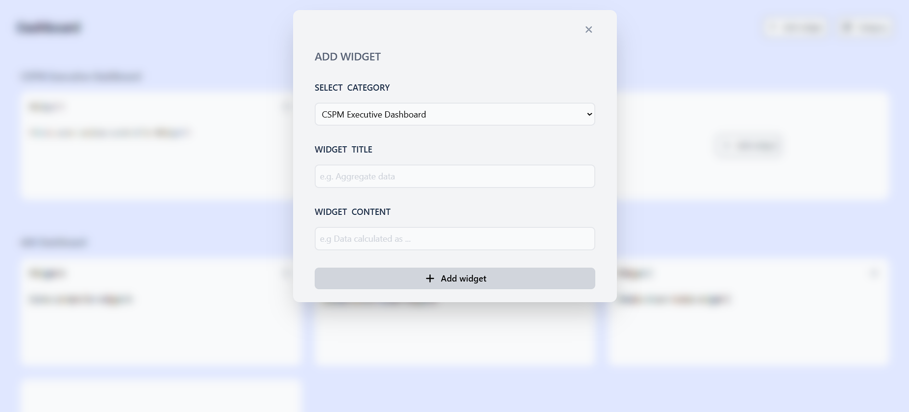
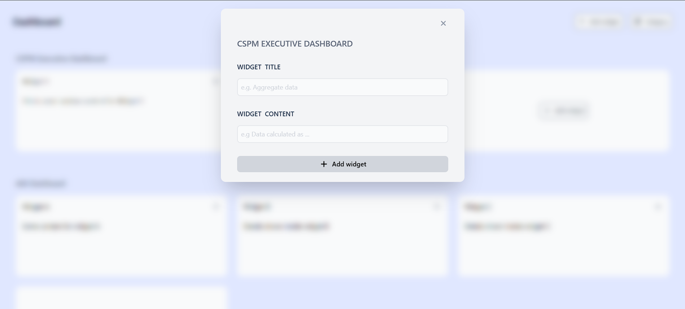
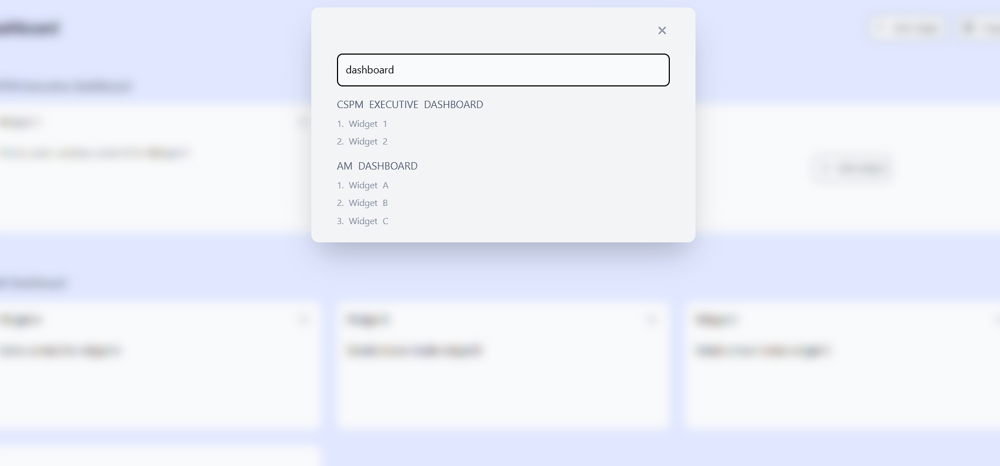

# DASHBOARD

Dashboard page where user can manage categories and widgets.



## Features

### 1. Manage categories



> Manage widgets for each category



> Add category

### 2. Add widgets



> Select any category and add widget



> Add widget for particular category

### 3. Search



> Search category or widgets

## Installation

### 1. Clone repository

```
git clone https://github.com/Abhishek-201099/Acuknox-dashboard.git
```

### 2. Install dependencies

```
cd Acuknox-dashboard
npm install
```

### 3. Start dev server

```
npm run dev
```
